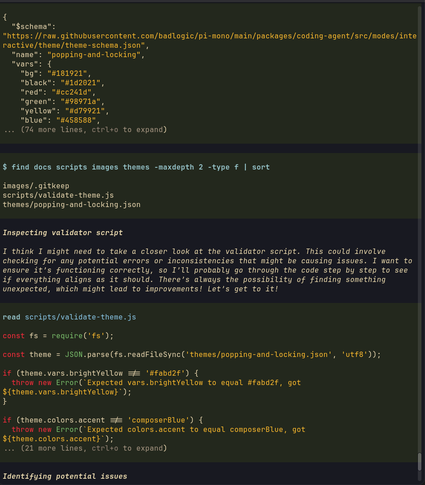
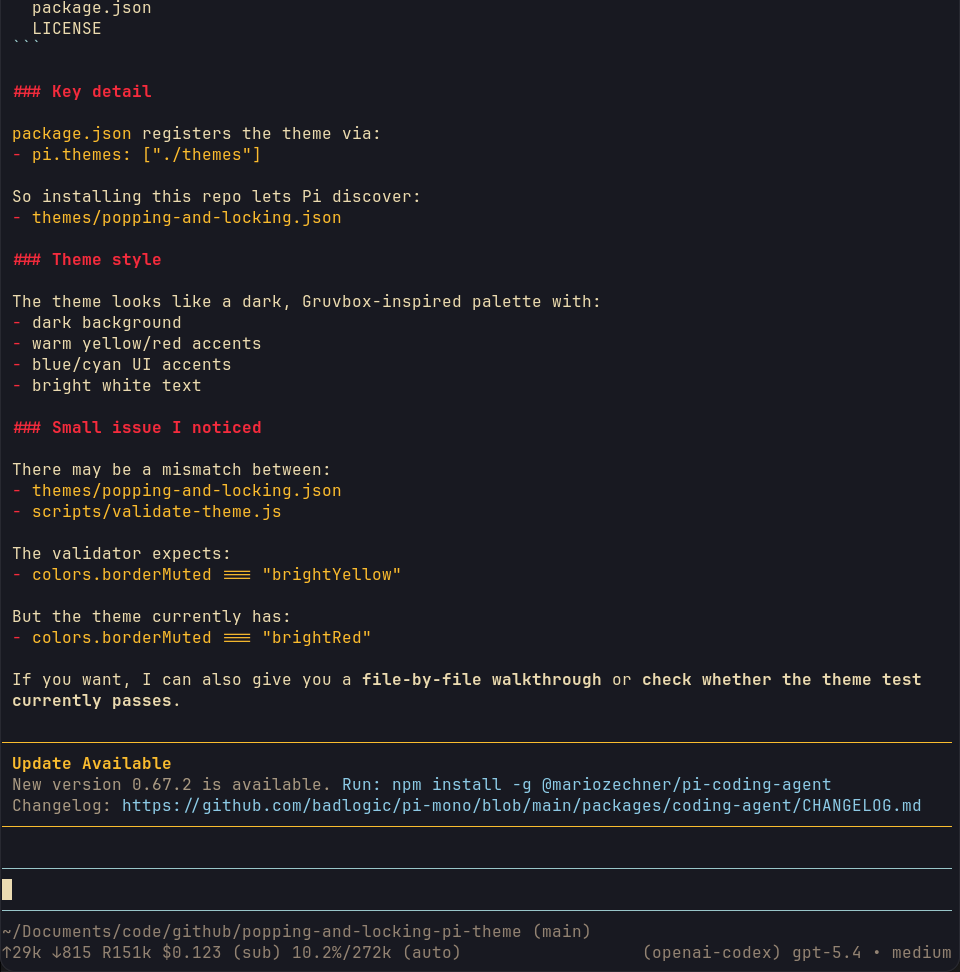

# popping-and-locking-pi-theme

A Pi package that adds the Popping and Locking theme for pi-agent. I could not help myself....

## Install

Install from GitHub:

```bash
pi install git:github.com/randoneering/popping-and-locking-pi-theme
```

Install from a local checkout:

```bash
pi install .
```

## Use

After installation, select the theme in pi with `/settings` and choose `popping-and-locking`.

You can also set it in `~/.pi/agent/settings.json` or `.pi/settings.json`:

```json
{
  "theme": "popping-and-locking"
}
```

## Preview





## Package layout

- `themes/popping-and-locking.json` — theme definition
- `package.json` — Pi package manifest

